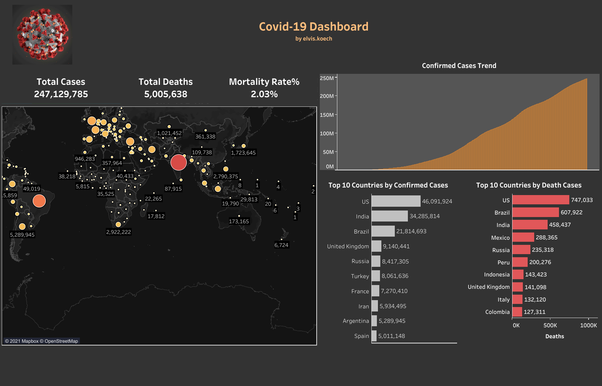

# Elvis.koech Portfolio
Data Analyst skilled in SQL, Tableau, PowerBI, Machine Learning, and Python

[Project 1 : Bank-churn-prediction-app ](https://github.com/ElvisKoech/bank-churn-prediction-app)
+ Customer churn (or customer attrition) is a tendency of customers to abandon a brand and stop being a paying client of a particular business.
+ I used a supervised machine learning classification approach to solve this problem and based on the number of target classes I built a binary classifier type of Machine learning model.
+ Data Source: Github Columns: 14 Rows: 10000
+ Using LogisticRegression ML Estimator, a bank can measure the likelihood of customer churn with an accuracy score of 0.813(81.3%) 
+ [Bank Churn Prediction Data App](https://bank-churn-prediction-data-app.herokuapp.com/)

[Project 2: Text Analysis App](https://github.com/ElvisKoech/Text-analysis-app)
+ Companies deal with huge amounts of data every day, from emails, chats, and social media posts, to customer support tickets, and survey responses. However, 80% of this data is unstructured and, therefore, hard to process – not to mention time-consuming if done manually.
+ Text analysis app can be used to visualize the unstructured data
* [Text-analysis-streamlit-app](https://text-analysis-streamlit-app.herokuapp.com/)
+ Development Dependencies: 
   * Python
   * Streamlit 
   * Natural Language ToolKit
+ Unstructured data can deliver countless insights that help you make informed, data-driven decisions that can improve the customer experience
   
[Project 3: Covid-19 Dashboard Using Tableau](https://public.tableau.com/app/profile/elvis.koech/viz/Covid-19DashboardwithTableau/Covid-19Dashboard)

 + I created an interactive Dashboard to visualize and track the current trend of covid-19 Cases
 + Dataset: Our World in Data
 
 
 
    
[Project 4 : SalesReport Using PowerBI](https://app.powerbi.com/reportEmbed?reportId=e009ea64-c003-4b4a-ae85-a3ef9ca402a0&autoAuth=true&ctid=9452da8e-d208-43a6-adba-719133ea70c1&config=eyJjbHVzdGVyVXJsIjoiaHR0cHM6Ly93YWJpLXNvdXRoLWFmcmljYS1ub3J0aC1hLXByaW1hcnktcmVkaXJlY3QuYW5hbHlzaXMud2luZG93cy5uZXQvIn0%3D)
+ I created an interactive Sales Dashboard to visualize Sales performance over the years
+  Dataset: Github
+  I used Data analysis Expression Language(DAX) to develop Revenue and Sales Quantity Measures
+  I Used  the Star Schema concept to link tables
